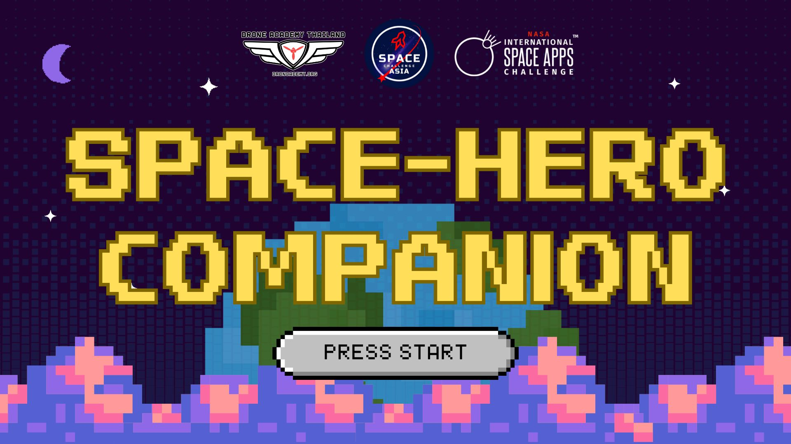

===
# Space-Hero Companion
## High-Level Summary
A virtual companion app called "Space-Hero Companion" was created to help astronauts on space missions. By offering an interactive and adaptable companion, it tackles the psychological and physical difficulties astronauts encounter, including stress and loneliness. By enabling astronauts to care for the virtual companion, the app lessens loneliness and fosters mental health. To further guarantee astronauts' long-term performance and safety, it also provides individualized health recommendations and tracks their health data in real-time. This project is significant because it integrates mental health support, entertainment, and health data analysis, creating a comprehensive tool for enhancing astronauts' general well-being in the taxing space environment. It improves mission success and the sustainability of long-term space exploration by attending to both physical and mental health.
## Project Demo (7 Slide Presentation)
[Google Drive](https://drive.google.com/file/d/1zE8VqYhfHZ3-SxWcURT3hv16bZl2aY0J/view?usp=sharing)

[View in this repository](resource/Space-Hero-Companion.pdf)
## Project Details
### What it does
A virtual pet program called Space-Hero Companion was created especially for astronauts traveling through space. It offers astronauts an adaptable digital companion to travel with them in the microgravity environment of space. The application does several tasks:
1. Provides company to fight solitude and loneliness
2. Offers pet care games as a stress-relieving hobby.
3. Tracks and evaluates astronaut health information
4. Provides individualized health guidance and inspirational materials
### How it works
1. Egg Selection: Before their virtual pet hatches, users select an egg.
2. Pet Care and Feeding: The app has a care system that requires astronauts to feed and engage with their companion on a regular basis. This influences the companion's emotions and behaviors by affecting its mood and happiness scale.
3. Customization: By altering their companion's look and surroundings, astronauts can enhance the fun and visual appeal of the experience.
4. Interactive Encouragement: The companion delivers motivational content, tracks accomplishments, and sends out encouraging messages. Users can get encouraging words by tapping on their pet.
5. Health Data Analysis: To monitor, avoid, and handle any possible health problems during the trip, the software gathers and evaluates the astronaut's health data in real-time.
6. Personalized Health Advice: To ensure astronauts' long-term safety and well-being, the app offers customized health advice based on the data gathered.
7. Multilingual Support: To improve communication, the app has language translation capabilities, enabling astronauts from other nations to use it.
### Benefits
1. Lessens Stress and Loneliness: Offers emotional support and company to assist astronauts decompress and fight loneliness in the limited space environment.
2. Improves Time Management Skills: Planning and organizing abilities are enhanced by consistent care routines for the virtual pet.
3. Encourages Creativity: Creating personalized spaces encourages original thought and gives people a way to express themselves in cramped quarters.
4. Enhances Health Monitoring: Analysis of real-time health data aids in the early identification and avoidance of possible health problems.
5. Improves Mission Performance: Astronauts can carry out their responsibilities more successfully if they maintain improved physical and mental health.
### Objective
1. To enhance astronauts' general health mainly mental while on extended space voyages
2. To offer a complete solution that takes into account the physical and mental health requirements of people in space.
3. To guarantee the performance and well-being of astronauts in order to support the sustainability and success of long-term space exploration
### Utilized tools and technologies
Unity game engine; C# programming language for scripting; real-time health data analysis; multilingual support; and virtual surroundings that can be customized

### Bottom line
By protecting the emotional and physical well-being of space travelers, this initiative shows a creative way to deal with the particular difficulties of extended space missions, which could have a big impact on space exploration in the future.
